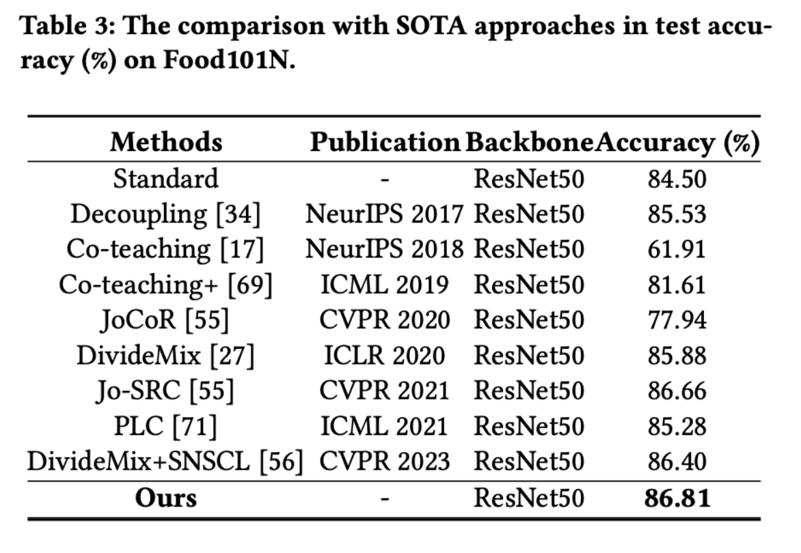
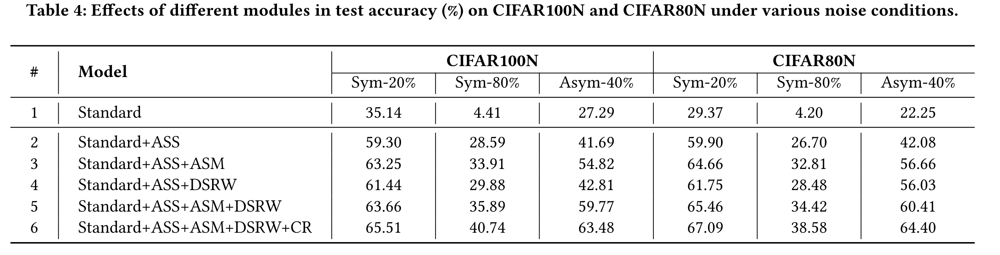

# Enhancing Robustness in Learning with Noisy Labels: An Asymmetric Co-Training Approach 
**Abstract:** Label noise, an inevitable issue in various real-world datasets, tends to impair the performance of deep neural networks.
A large body of literature focuses on symmetric co-training, aiming to enhance model robustness by exploiting interactions between models with distinct capabilities.
However, the symmetric training processes employed in existing methods often culminate in model consensus, diminishing their efficacy in handling noisy labels.
To this end, we propose an Asymmetric Co-Training (ACT) method to mitigate the detrimental effects of label noise. 
Specifically, we introduce an asymmetric training framework in which one model (i.e., RTM) is robustly trained with a selected subset of clean samples while the other (i.e., NTM) is conventionally trained using the entire training set.
We propose two novel criteria based on agreement and discrepancy between models, establishing asymmetric sample selection and mining.
Moreover, a metric, derived from the divergence between models, is devised to quantify label memorization, guiding our method in determining the optimal stopping point for sample mining.
Finally, we propose to dynamically re-weight identified clean samples according to their reliability inferred from historical information.
We additionally employ consistency regularization to achieve further performance improvement.
Extensive experimental results on synthetic and real-world datasets demonstrate the effectiveness and superiority of our method.


# Pipeline
The differences between existing symmetric co-training strategies:


The overall framework of our proposed ACT:


# Installation
```
pip install -r requirements.txt
```

# Datasets
We conduct noise robustness experiments on a synthetically corrupted dataset (i.e., CIFAR100N) and four real-world datasets (i.e., Web-Aircraft, Web-Car, Web-Bird and Food101N).
Specifically, we create the noisy dataset CIFAR100N based on CIFAR100.
We adopt two classic noise structures: symmetric and asymmetric, with a noise ratio $n \in (0,1)$.

You can download the CIFAR10 and CIFAR100 on [this](https://www.cs.toronto.edu/~kriz/cifar.html).

You can download Web-Aircraft, Web-Car, and Web-Bird from [here](https://github.com/NUST-Machine-Intelligence-Laboratory/weblyFG-dataset).

You can download Food101N from [here](https://kuanghuei.github.io/Food-101N/).

# Training

An example shell script to run ACT on CIFAR-100N :

```python
main.py --gpu 0  --noise-type symmetric --closeset-ratio 0.2 --dataset cifar100nc
```
An example shell script to run ACT on CIFAR-80N :

```python
main.py --gpu 0  --noise-type symmetric --closeset-ratio 0.2 --dataset cifar80no
```
Here is an example shell script to run ACT on Web-Aircraft :

```python
main_web.py --gpu 0 --dataset web-aircraft
```

Here is an example shell script to run ACT on Food101N :

```python
main_food101n.py --gpu 9  --warmup-epoch 5 --epoch 50 --batch-size 100 --lr 0.0005 --lr1 0.001 --warmup-lr 0.001  --lr-decay cosine:5,5e-5,50 --opt sgd --dataset food101n
```

# Results on Cifar100N and Cifar80N:


# Results on Web-Aircraft, Web-Bird, and Web-Car:


# Results on Food101N:



# Effects of different modules on CIFAR100N and CIFAR80N under various noise conditions.:


